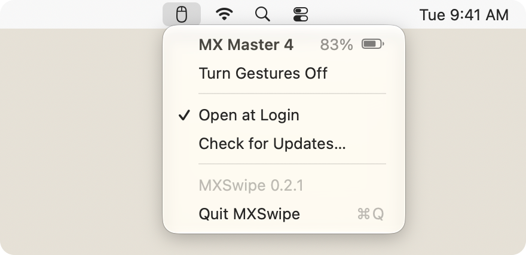

# MXSwipe

Trackpad-style Spaces and Mission Control gestures for the Sense Panel on the Logitech MX Master 4.

## What macOS doesn't do

On a trackpad, switching Spaces or opening Mission Control is continuous: the desktop moves with your
fingers, reverses when they do, and commits or springs back when you let go. macOS drives that
animation only from Apple's multi-touch devices. There is no public API for anything else, so mouse
gestures, including the MX Master 4's Sense Panel, can only trigger the equivalent keyboard shortcut,
and the desktop jumps.

## What MXSwipe does

- It reads the Sense Panel directly over Logitech's HID++ protocol and posts the same DockSwipe
  events a trackpad produces, so the desktop follows your thumb through pauses and reversals.
  Logi Options+ is not needed, and the panel keeps working in password fields and anywhere else
  Secure Input is on.
- A tap on the panel opens Mission Control.
- The horizontal thumb wheel sends continuous, pixel-precise scroll events with the phases a
  two-finger trackpad scroll has, following your natural scrolling setting. Each app decides what
  they do, so documents scroll sideways and Safari can swipe between pages. The main wheel is
  unchanged, and there is no momentum after you let go.
- The menu-bar icon is bright while gestures work and faded while they're off or the mouse isn't
  connected. The menu shows the mouse and its battery.

| Sense Panel | Action |
|---|---|
| Tap | Mission Control |
| Hold and drag up | Mission Control |
| Hold and drag down | Close Mission Control, when it is open |
| Hold and drag left | Next Space |
| Hold and drag right | Previous Space |

As on a trackpad, dragging left brings in the next Space. A dead zone ignores the small movement a
press causes, and each drag locks to the axis it starts on. Dragging down does nothing on the desktop, where the same gesture opens App Exposé.

  <picture>
    <source media="(prefers-color-scheme: dark)" srcset="assets/menu-dark.png">
    
  </picture>

Turning gestures off, or quitting, hands the panel and thumb wheel back to the mouse. The panel's
haptic click, which MXSwipe turns off, comes back the next time the mouse sleeps.

### Permission

Posting gestures and shortcuts needs Accessibility permission. MXSwipe asks on first launch and starts
as soon as the switch is on. If the switch is on but the menu still asks, the stored entry no longer
matches the app's signature: open the menu, hold Option, and choose Reset Accessibility Permission.

### Private calls

- DockSwipe is the event the Dock reads from a trackpad. On macOS 26 it is a pair of CGEvents with
  private fields; on macOS 27 it is a CGEvent carrying a private IOKit `HIDEvent`, resolved at run
  time. The layout changed between those releases, so a new major release is enabled only once it
  has been validated. Until then, or if the private API is missing, a released swipe becomes the
  Control-arrow shortcut from Keyboard Shortcuts › Mission Control, without the live tracking. The
  field layout was informed by the reverse engineering in
  [Mac Mouse Fix](https://github.com/noah-nuebling/mac-mouse-fix)
  ([MMF License](https://github.com/noah-nuebling/mac-mouse-fix/blob/master/License)).
- Taps and the fallback press Control-arrow with `AXUIElementPostKeyboardEvent`, because system
  shortcuts ignore key events that apps post. Whether Mission Control is open is read from the
  Dock's Accessibility tree.

## Install

Download `MXSwipe-<version>-macOS.zip` from the [latest release](https://github.com/mstallone/mxswipe/releases/latest),
unzip, and move MXSwipe.app to /Applications. It is a universal binary, signed with Developer ID,
notarized, and requires macOS 26 or later (validated on 26.5.2 and 27.0) and an MX Master 4 connected
through a Logi Bolt receiver. It updates itself through [Sparkle](https://sparkle-project.org).

MXSwipe was called MX Master Input before 0.2.1; existing copies update in place.

## Building

`./build.sh` builds with SwiftPM, signs with an Apple Development identity so the Accessibility grant
survives rebuilds, installs to /Applications, and launches. It refuses to overwrite a release build
unless given `--replace`. `swift test` runs the tests. The hardware probe reads a connected
MX Master 4 without changing it, and is skipped unless asked for:

    MXMASTER_RUN_HARDWARE_PROBE=1 swift test --filter SecureInputHardwareProbeTests

    Sources/MXSwipe/main.swift              app lifecycle, menu, permission, reconnecting
    Sources/MXSwipe/MenuHeader.swift        the menu's first row: the mouse and its battery or status
    Sources/MXSwipe/Session.swift           HID++ session: discovery, configuration, wake recovery
    Sources/MXSwipe/HIDPP.swift             HID++ reports, feature IDs, battery readings
    Sources/MXSwipe/HIDDevice.swift         IOKit access to the receiver's HID++ interface
    Sources/MXSwipe/GestureRecognizer.swift panel motion to one continuous gesture
    Sources/MXSwipe/DockSwipe.swift         gestures to Dock swipes, shortcut fallback
    Sources/MXSwipe/ThumbWheel.swift        thumb wheel to trackpad-style scrolling
    Sources/SystemEvents/                   the macOS 27 HIDEvent and the Accessibility key press
    Resources/Info.plist                    bundle template; the version is stamped at build time
    Tools/make-icon.swift                   renders AppIcon.icns
    Tools/make-readme-assets.swift          renders the menu images in this README
    Scripts/build-app.sh                    stages MXSwipe.app from a built binary
    Scripts/sign.sh                         signs the app and Sparkle inside out
    Scripts/build-release.sh                CI: universal build, Developer ID, notarize, staple, zip
    Scripts/generate-appcast.sh             CI: signed Sparkle appcast for the release
    Scripts/SecureInputGestureTest.applescript  manual check of the panel in a password field

## Releasing

The tag is the version. Pushing `vMAJOR.MINOR.PATCH` runs the Release workflow: tests, universal build,
Developer ID signature with hardened runtime and timestamp, notarization, stapling, Gatekeeper check,
then a GitHub Release with the zip, its SHA-256, and a signed Sparkle `appcast.xml`.

    git tag v0.2.1 && git push origin v0.2.1

| Secret | Contents |
|---|---|
| `DEVELOPER_ID_CERTIFICATE_BASE64` | base64 of the Developer ID Application `.p12` |
| `DEVELOPER_ID_CERTIFICATE_PASSWORD` | its export password |
| `APPLE_NOTARY_PRIVATE_KEY_BASE64` | base64 of the App Store Connect API key (`.p8`) |
| `APPLE_NOTARY_KEY_ID` | that key's ID |
| `APPLE_NOTARY_ISSUER_ID` | the App Store Connect issuer ID |
| `SPARKLE_ED_PRIVATE_KEY` | the EdDSA key from Sparkle's `generate_keys` |

The public half of the Sparkle key is `SUPublicEDKey` in `Resources/Info.plist`. Installed copies accept
only updates signed with that key and the same Developer ID team, so keep a backup of both.

MXSwipe is an independent project, not affiliated with Apple or Logitech.

## License

MIT. See [LICENSE](LICENSE).
